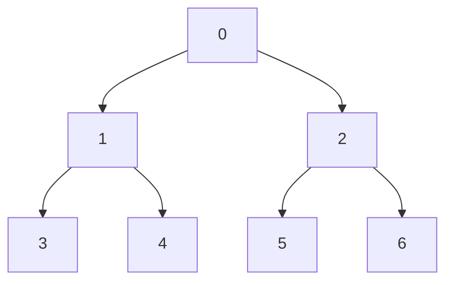
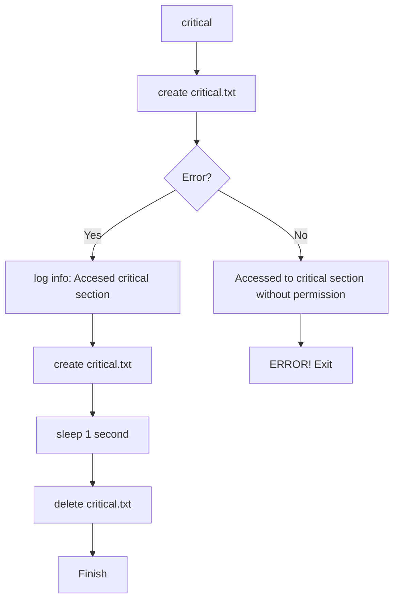
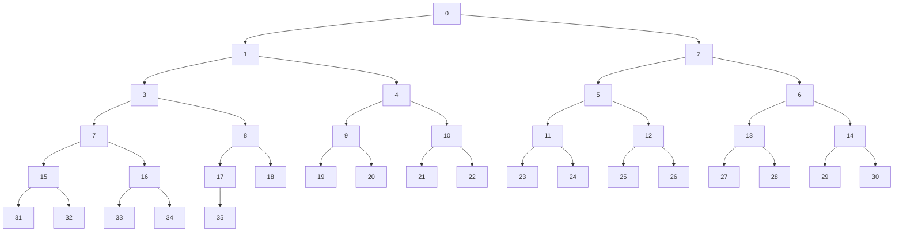

# <center>Отчет по курсу <br>"Распределенные системы"</center>

<center>Реализовать программу, использующую древовидный маркерный алгоритм для прохождения процессами критических секций.</center>
---

<div style="text-align: right"> 
Студент <b>420</b> группы 

__Трапезников Михаил Юрьевич__
</div>

## Описание алгоритма

Задание:
> Все 36 процессов, находящихся на разных ЭВМ сети, одновременно выдали запрос на вход в критическую секцию. Реализовать программу, использующую древовидный маркерный алгоритм для прохождения всеми процессами критических секций.

__Небольшое замечание__: из-за нехватки ресурсов компьютера создать именно 36 процессов, использовался метод динамического задания параметра процессов(в тестах использовался параметр 7, так как описывал полное сбалансированное дерево высоты 3). Так же для большей наглядности процессы попадают в КС(отправляют запрос) последовательно(параллельная версия возможна, но из-за усложненной отладки, не приводится)

### Алгоритм маркерного дерева Raymond

Для написания программы использовался __Древовидный маркерный алгоритм Рэймонда__:

- Попадание в критическую секцию(далее __КС__):
   1. Если есть маркер, то процесс выполняет КС;
   2. Если маркера нет, то процесс:
      1. Помещает запрос в очередь запросов;
      2. Посылает сообщение `Запрос` в направлении владельца маркера и ожидает сообщений;
- Поведение при получении сообщений(есть 2 типа сообщений - `Запрос` и `Маркер`):
   - Пришло сообщение `Маркер`:
        1. Взять 1-ый процесс из очереди и послать маркер автору(может быть, себе);
        2. Поменять значение указателя в сторону маркера на актуальное;
        3. Исключить запрос из очереди;
        4. Если в очереди есть запросы, отправить `Запрос` в направлении владельца маркера;
    - Пришло сообщение `Запрос`:
        1. Поместить запрос в очередь;
        2. Если маркера нет, отправить `Запрос` в направлении маркера;
        3. Иначе перейти к пункту __1__ для `Маркер`'а

### Программная реализация

Для реализации алгоритма из предыдущего параграфа использовался язык `Rust` с средствами `MPI` для параллелизации.

#### Разные виды сообщений

Для идентификации разных сообщений использовалась структура данных `Rust` `enum`(не конкретизируя значения можно идентифицировать тип - __для обработки поведения процесса при получении соощения__):
```rust
enum SIGNAL {
    Marker,
    Request,
}
```

#### Структура процессов "сбалансированное дерево"

Для реализации задачи использовалось в качестве сбалансированного дерева процессов - __куча__:
- Корень дерева - процесс с рангом __0__;
- Листья текущего элемента дерева с рангом $\mathbb{k}$:
  - Процесс с рангом $\mathbb{2\times k+1}$;
  - Процесс с рангом $\mathbb{2\times k+2}$;

Для программы из 7 процессов дерево представляется в следующем виде:


По определению алгоритма каждый элемент дерева должен хранить:
- __Маркер__: `bool = true/false`;
- __Указатель на маркер__: `int`(в терминологии `Rust` `i32`):
  - `0` - Маркер находится в направлении __родительского элемента дерева__;
  - `1` - Маркер находится в направлении ___левого_ сына__;
  - `2` - Маркер находится в направлении ___правого_ сына__.
- __Очередь запросов__: (`vector<int>` в терминологии `Rust` `Vec<i32>`):
  - __LIFO__ структура для обработки очередности доступов к КС(в предлагаемом решении из-за последовательности запросов используется __FIFO__ модель);
- Кроме основных переменных на основе описания алгоритма используются вспомогательные для _упрощенного_ управления деревом:
  - __Ранг процесса в текущем элементе дерева__: `i32`;
  - __Ранг процесса в родительском элементе дерева__: `i32`(если родителя нет, вместо неотрицательного числа `-1`);
  - __Ранги процессов в дочерних элементах дерева__: `i32`(если нет дочернего элемента `-1`).

Таким образом, каждый процесс хранит в своей памяти один экземпляр элемента дерева следующего описания:

```rust
#[derive(Debug)]
struct ProcTree {
    queue: Vec<i32>, // Очередь запросов в текущем элементе дерева
    rk: i32,         // Идентификатор процесса - RANK(MPI)
    root: i32,       // Идентификатор "родителя" в древовидной схеме процессов
    // - номер идентификатора родительского процесса - RANK(MPI)
    left: i32, // Идентификатор "левого сына" в древовидной схеме процессов
    // - RANK(MPI)
    right: i32, // Идентификатор "правого сына" в древовидной схеме процессов
    // - RANK(MPI)
    to_proc: i32, // Указатель направления маркера:
    // - 0 - parent,
    // - 1 - left child,
    // - 2 - right child
    marker: bool, // Идентификатор наличия маркера для доступа к КС
}
```

- `#[derive(Debug)]` означает, что во время вызова печати структуры напечатается отладочная информация про элемент;

#### Методы элементов дерева

Основные методы элементов дерева:
- `receive` - поведение процесса при получении сообщения;
- `critical` - поведение процесса при получении доступа к КС;

##### Доступ к КС

> Критическая секция:
<проверка наличия файла “critical.txt”>;
if (<файл “critical.txt” существует>) {
<сообщение об ошибке>;
<завершение работы программы>;
} else {
<создание файла “critical.txt”>;
sleep (<случайное время>);
<уничтожение файла “critical.txt”>;
}

Аналогичным образом реализована соответствующая функция на языке `Rust`:

```rust
fn critical(&mut self) {
    let result = match File::open("critical.txt") {
        Ok(_) => {
            println!("Accessed to critical section without permission");
            -1
        }
        Err(_) => 0,
    };

    if result == 0 {
        let fname: String = self.rk.to_string() + ".txt";
        let mut file = OpenOptions::new()
            .write(true)
            .append(true)
            .open(fname)
            .unwrap();
        file.write_all(b"Accesed critical section\n")
            .expect("Error writing");
        File::create("critical.txt").expect("Error creating critical.txt");
        thread::sleep(Duration::from_secs(1));
        fs::remove_file("critical.txt").expect("Error deleting critical.txt");
    } else {
        println!("Critical file exsisted! ERROR! Terminating...");
        process::abort();
    }
}
```

Схематичное описание программного кода выше:



Как следует из описания и визуальной интерпретации:
1. Проверяется наличие файла `critical.txt`:
    ```rust
    let result = match File::open("critical.txt") {
        Ok(_) => {
            println!("Accessed to critical section without permission");
            -1
        }
        Err(_) => 0,
    };
    ```
    инструкция `File::open(...)` возвращает значение типа `Result`, которое может принмать __2__ состояния:
    - `Ok(...)` - операция выполнена __успешно__;
    - `Err(...)` - __произошла ошибка__ выполнения.
    В случае задачи __успешное открытие файла__ является сигналом одновременного доступа нескольких процессов КС, что есть ошибка. Ошибка же означает отсутствие файла `critical.txt`, поэтому работа функции продолжается;
2. Сравнивается значение `result`:
   - если `result == 0`, значит выполнение корректно; информация о том, что процесс достигает КС, дописывается в файл `[RANK].txt`, где `RANK` - __ранг процесса__:
    ```rust
    let fname: String = self.rk.to_string() + ".txt";
    let mut file = OpenOptions::new()
        .write(true)
        .append(true)
        .open(fname)
        .unwrap();
    file.write_all(b"Accesed critical section\n")
        .expect("Error writing");
    ```
      1. Далее создается файл `critical.txt` и процесс засыпает на __1 секунду__, после этого файл удаляется:
    ```rust
    File::create("critical.txt").expect("Error creating critical.txt");
    thread::sleep(Duration::from_secs(1));
    fs::remove_file("critical.txt").expect("Error deleting critical.txt");
    ```
   - Иначе возникает ошибка, информация об ошибке выводится в терминал и программа аварийно завершается:
   ```rust
   println!("Critical file exsisted! ERROR! Terminating...");
   process::abort();
   ```

##### Обработка сообщений 

Как следует из описания алгоритма, поведение процесса при получении сообщения делится на __2__ типа:
- `SIGNAL::Marker`:
  1. Если очередь запросов непуста, извлекается первый элемент и выводится информация о процессе и обновленной очереди его запросов:
   ```rust
   if let Some(first_in_queue) = self.queue.pop() {
        println!(
            "Extracted {}. Stack of {} is {:?}",
            first_in_queue, self.rk, &self.queue
        );
        ...
   }
   ```
   2. Сравнивается значение запроса с __4__-мя значениями - связями в дереве(сам процесс, родитель, правый сын, левый сын; и в противном случае возникает ошибка и выводится сообщение в терминал):
   ```rust
    match first_in_queue {
        _ if self.rk == first_in_queue => {
            ...
        }
        rooter if self.root == first_in_queue => {
            ...
        }
        left if self.left == first_in_queue => {
            ...
        }
        right if self.right == first_in_queue => {
            ...
        }
        _ => println!("Invalid rank in queue {}", first_in_queue),
    }
   ```
    3. В зависимости от значения, возможны варианты:
        - Если процесс должен отправить маркер __себе__, то он:
          1. Обновляет значение маркера(маркер в данном процессе);
          2. Получает доступ к КС:
            ```rust
            self.marker = true;
            ProcTree::critical(self)
            ```
        - Если же процесс должен отправить маркер __родителю__: 
          1. Выводится информация об этом действии:
            ```rust
            println!("SEND TO ROOT {} FROM {}", rooter, self.rk);
            ``` 
          2. Обновляется параметр отсутствия маркера и направления маркера в направлении родителя, также логируется в файле процесса отправка маркера:
            ```rust
            self.marker = false;
            self.to_proc = 0;
            let fname: String = self.rk.to_string() + ".txt";
            let mut file = OpenOptions::new()
                .write(true)
                .append(true)
                .open(fname)
                .unwrap();

            file.write_all(b"Send Marker to root\n")
                .expect("Error logging info");
            ```
          3. Отправляется сообщение родителю средствами `MPI` с кодом `0`, что означает сообщение вида `Marker`:
            ```rust
            world.process_at_rank(rooter).send(&0)
            ```
            , где `rooter` - номер ранга __родительского процесса дерева__;
        - Аналогичное поведение в случае отправки левому или правому сыну, поэтому просто приводится фрагмент кода этих секций:
          - Левый сын:
            ```rust
            println!("SEND TO CHILD {} FROM {}", left, self.rk);
            self.marker = false;
            self.to_proc = 1;
            let fname: String = self.rk.to_string() + ".txt";
            let mut file = OpenOptions::new()
                .write(true)
                .append(true)
                .open(fname)
                .unwrap();

            file.write_all(b"Send Marker to left child\n")
                .expect("Error logging info");
            world.process_at_rank(left).send(&0)
            ```
          - Правый сын:
            ```rust
            println!("SEND TO CHILD {} FROM {}", right, self.rk);
            self.marker = false;
            self.to_proc = 2;
            let fname: String = self.rk.to_string() + ".txt";
            let mut file = OpenOptions::new()
                .write(true)
                .append(true)
                .open(fname)
                .unwrap();

            file.write_all(b"Send Marker to right child\n")
                .expect("Error logging info");
            world.process_at_rank(right).send(&0)
            ```
          - В случае ошибки `_ => ...` выводится информация об ошибке и идентификатор процесса, где возникла ошибка:
            ```rust
            println!("Invalid rank in queue {}", first_in_queue),
            ```
    4. Если очередь запросов не пуста, то отправить запрос за маркером:
        ```rust
        if let Some(top) = self.queue.pop() {
            ProcTree::receive(self, SIGNAL::Request, world, top, iter, size);
        }
        ```
- `SIGNAL::Request`:
    1. Добавляем процесс в очередь процессов(добавляемый процесс - номер процесса-отправителя) и вывод обновленного состояния очереди запросов для процесса:
        ```rust
        self.queue.push(sender);

        println!("Stack of {} is {:?}", self.rk, &self.queue);
        ```
    2. Если маркер у данного процесса, то эмулируем поведения сообщения __Маркер__ текущему процессу:
        ```rust
        if self.marker {
            // Если маркер есть в процессе, отправляем сообщение MARKER себе же
            ProcTree::receive(self, SIGNAL::Marker, world, self.rk, iter, size);
        }
        ```
    3. Иначе отправить сообщение запрос в направлении маркера(в точности совпадает с ситуацией отправки маркера за тем лишь отличем, что сообщение содержит идентификатор не __0__(Маркер), а __1__(Запрос)):
        ```rust
        match self.to_proc {
            0 => {
                let fname: String = self.rk.to_string() + ".txt";
                let mut file = OpenOptions::new()
                    .write(true)
                    .append(true)
                    .open(fname)
                    .unwrap();

                file.write_all(b"Send Recieve to root\n")
                    .expect("Error logging info");
                world.process_at_rank(self.root).send(&1)
            }
            1 => {
                let fname: String = self.rk.to_string() + ".txt";
                let mut file = OpenOptions::new()
                    .write(true)
                    .append(true)
                    .open(fname)
                    .unwrap();

                file.write_all(b"Send Recieve to left child\n")
                    .expect("Error logging info");
                world.process_at_rank(self.left).send(&1)
            }
            2 => {
                let fname: String = self.rk.to_string() + ".txt";
                let mut file = OpenOptions::new()
                    .write(true)
                    .append(true)
                    .open(fname)
                    .unwrap();

                file.write_all(b"Send Recieve to right child\n")
                    .expect("Error logging info");
                world.process_at_rank(self.right).send(&1)
            }
            // Неправильный параметр to_proc(направление маркера)
            _ => println!("Invalid to_proc field {}", self.to_proc),
        }
        ```

__Пример__:

Покажем пример поведения алгоритма при наличии маркера в процессе с __рангом 6__, желании попасть в критическую секцию __3-му процессу__(дерево из 7 процессов, как было показано ранее)

__Request__:

1. Формируем запрос в __3__
    ```mermaid
    graph TD;
        0 --> 1
        0 --> 2
        1 --> 3[3: REQUEST, STACK: 3]
        1 --> 4
        2 --> 5
        2 --> 6[6: MARKER]
        1 -- to_proc --> 0
        3 -- to_proc --> 1
        4 -- to_proc --> 1
        0 -- to_proc --> 2
        5 -- to_proc --> 2
        2 -- to_proc --> 6
    ```
2. Передаем запрос в направлении маркера:
    ```mermaid
    graph TD;
        0 --> 1[1: REQUEST, STACK: 3]
        0 --> 2
        1 --> 3[3: STACK: 3]
        1 --> 4
        2 --> 5
        2 --> 6[6: MARKER]
        1 -- to_proc --> 0
        3 -- to_proc --> 1
        4 -- to_proc --> 1
        0 -- to_proc --> 2
        5 -- to_proc --> 2
        2 -- to_proc --> 6
    ```
    ```mermaid
    graph TD;
        0[0: REQUEST, STACK: 1] --> 1[1: STACK: 3]
        0 --> 2
        1 --> 3[3: STACK: 3]
        1 --> 4
        2 --> 5
        2 --> 6[6: MARKER]
        1 -- to_proc --> 0
        3 -- to_proc --> 1
        4 -- to_proc --> 1
        0 -- to_proc --> 2
        5 -- to_proc --> 2
        2 -- to_proc --> 6
    ```
    ```mermaid
    graph TD;
        0[0: STACK: 1] --> 1[1: STACK: 3]
        0 --> 2[2: REQUEST, STACK: 0]
        1 --> 3[3: STACK: 3]
        1 --> 4
        2 --> 5
        2 --> 6[6: MARKER]
        1 -- to_proc --> 0
        3 -- to_proc --> 1
        4 -- to_proc --> 1
        0 -- to_proc --> 2
        5 -- to_proc --> 2
        2 -- to_proc --> 6
    ```
    ```mermaid
    graph TD;
        0[0: STACK: 1] --> 1[1: STACK: 3]
        0 --> 2[2: STACK: 0]
        1 --> 3[3: STACK: 3]
        1 --> 4
        2 --> 5
        2 --> 6[6: MARKER, REQUEST, STACK: 2]
        1 -- to_proc --> 0
        3 -- to_proc --> 1
        4 -- to_proc --> 1
        0 -- to_proc --> 2
        5 -- to_proc --> 2
        2 -- to_proc --> 6
    ```
3. Достигли маркера, далее происходит передача сообщений `Marker` и обновление путей до маркера:


__Marker__:
1. Передача маркера в первому запросу из очереди и уменьшение очереди:
    ```mermaid
    graph TD;
        0[0: STACK: 1] --> 1[1: STACK: 3]
        0 --> 2[2: MARKER, STACK: 0]
        1 --> 3[3: STACK: 3]
        1 --> 4
        2 --> 5
        2 --> 6[6: STACK: ]
        1 -- to_proc --> 0
        3 -- to_proc --> 1
        4 -- to_proc --> 1
        0 -- to_proc --> 2
        5 -- to_proc --> 2
        6 -- to_proc --> 2
    ```
    ```mermaid
    graph TD;
        0[0: MARKER, STACK: 1] --> 1[1: STACK: 3]
        0 --> 2[2: STACK: ]
        1 --> 3[3: STACK: 3]
        1 --> 4
        2 --> 5
        2 --> 6[6: STACK: ]
        1 -- to_proc --> 0
        3 -- to_proc --> 1
        4 -- to_proc --> 1
        2 -- to_proc --> 0
        5 -- to_proc --> 2
        6 -- to_proc --> 2
    ```
    ```mermaid
    graph TD;
        0[0: STACK:] --> 1[1: MARKER, STACK: 3]
        0 --> 2[2: STACK: ]
        1 --> 3[3: STACK: 3]
        1 --> 4
        2 --> 5
        2 --> 6[6: STACK: ]
        0 -- to_proc --> 1
        3 -- to_proc --> 1
        4 -- to_proc --> 1
        2 -- to_proc --> 0
        5 -- to_proc --> 2
        6 -- to_proc --> 2
    ```
    ```mermaid
    graph TD;
        0[0: STACK:] --> 1[1: STACK:]
        0 --> 2[2: STACK: ]
        1 --> 3[3: MARKER, STACK: 3]
        1 --> 4
        2 --> 5
        2 --> 6[6: STACK: ]
        0 -- to_proc --> 1
        1 -- to_proc --> 3
        4 -- to_proc --> 1
        2 -- to_proc --> 0
        5 -- to_proc --> 2
        6 -- to_proc --> 2
    ```
__Маркер достиг фрагмента, где в очереди запрос с его же номером, значит доступ к КС__.

#### Функция `main`

Как и для всех `MPI`-программ создается среда выполнения:
```rust
let universe = mpi::initialize().unwrap();
let world = universe.world();
let size = world.size();
let rank = world.rank();
```

Далее происходит устновка корня дерева(кучи) элементом с __рангом 0__ и определение владельца маркера(из командной строки или по умолчанию в __последнем процессе__):
```rust
// Корнем дерева процесса считается 0-ой процесс(структура дерева - КУЧА)
let tree_node_proc = 0;
// Аргумент командной строки указывает, где хранится маркер
let args: Vec<String> = env::args().collect();
let marker_node: i32 = match {
    if args.get(1).is_none() {
        String::new()
    } else {
        args[1].clone()
    }
}
.trim()
.parse::<i32>()
{
    Ok(num) => num,
    Err(_) => {
        // Если ничего не указано в командной строке,
        // то маркер расположим на последнем процессе
        if rank == tree_node_proc {
            println!(
                "No number entered, so marker will be at process with rank={}.",
                size - 1
            );
        }
        size - 1
    }
};
```

Далее создаются вспомогательные переменные для корректной инициаллизации пути до маркера в дереве и заполнение пути от корня дерева до самого элемента с маркером:
```rust
let mut marker_cnt = marker_node.clone();
let mut child_to_path = HashMap::new();

while marker_cnt != tree_node_proc {
    child_to_path.insert((marker_cnt - 1) / 2, marker_cnt);
    marker_cnt = (marker_cnt - 1) / 2;
}
```

Затем в каждом процессе создается __свой один экземпляр дерева__ с корректными связями и __пока некорректным путем до маркера(по умолчанию - в родителе и в левом сыне для корневого процесса)__:
```rust
let mut tree_elem = match rank {
    0 => ProcTree {
        queue: Vec::new(),
        rk: tree_node_proc,
        root: -1,
        left: 1,
        right: 2,
        to_proc: 1,
        marker: marker_node == tree_node_proc,
    },
    num => {
        let mut left = 2 * num + 1;
        if left >= size {
            left = -1;
        }

        let mut right = 2 * num + 2;
        if right >= size {
            right = -1;
        }

        ProcTree {
            queue: Vec::new(),
            rk: num,
            root: (num - 1) / 2,
            left,
            right,
            to_proc: 0,
            marker: marker_node == num,
        }
    }
};
```

Определение зависит от ранга процесса(у корневого нет родителей, у листьев нет детей). Структура изменяемая(ключевое слово `mut`), так как очередь процессов и направления маркера с его наличием - __изменяемые переменные__.

Затем устанавливается корректный маршрут до маркера в графе и создается для каждого процесса файл логирования:
```rust
let fname: String = rank.to_string() + ".txt";
File::create(fname).expect("Error rank creation file");
let relative_marker_path = child_to_path[&rank];

if child_to_path.contains_key(&rank) {
    if tree_elem.left != -1 && relative_marker_path == tree_elem.left {
        tree_elem.to_proc = 1;
    } else if tree_elem.right != -1 && relative_marker_path == tree_elem.right {
        tree_elem.to_proc = 2;
    }
}
```

Краткая идея метода:
- Если текущий процесс есть в установленном заранее пути до процесса с маркером, то смотрим на значение словаря этого пути(ключ - __процесс__, значение - __в каком дочернем узле находится маркер(левом или правом)__):
  - Если значение в словаре - левый сын, то указываем путь равный __1__;
  - Если - правый сын, то значение __2__;
  - Иначе оставляем по умолчанию __0__(через родителя), что есть корректное значение.
  
#### Распределенный доступ к КС

Для лучшей интепретации эмулируем последовательный доступ к КС от всех процессов с `0`-го до `size-1`-го.

Заводим служебную переменную предыдущего владельца маркера(нужно для отладочной информации); изначально равен номеру процесса, где распологался маркер:
```rust
let mut previous_marker: i32 = marker_node;
```

Цикл последовательного доступа итерируется по параметру `request_sender`:
```rust
for request_sender in 0..size {
    ...
}
```

На каждой итерации ожидаем все процессы(чтобы завершили предыдущую итерацию) и добавляем в файл логирования информацию о начале новой итерации и окончании предыдущей:
```rust
world.barrier();

// Логируем информацию об итерациях
let fname: String = tree_elem.rk.to_string() + ".txt";
let mut file = OpenOptions::new()
    .write(true)
    .append(true)
    .open(fname)
    .unwrap();
if request_sender > 0 {
    file.write_all(b"####################\n")
        .expect("Error logging info");
}

let log_info = format!(
    "####################\nIteration {}/{}\n",
    request_sender + 1,
    size
);
file.write_all(log_info.as_bytes())
    .expect("Error logging info");
```

Средствами `MPI` выводим текущее состояние дерева процессов на каждой итерации:
- От родительского процесса(изначально - от корня) отправляем сообщения сыновьям и выводим в каждом процессе его элемент дерева, __НО__ только после получения сообщения от родительского процесса:
    ```rust
    if rank == 0 {
        println!(
            "\n###############################################
            Iteration {}/{}. Process tree is:",
            request_sender + 1,
            size
        );
        if tree_elem.left != -1 {
            world
                .process_at_rank(tree_elem.left)
                .send(&tree_elem.marker);
        }
        if tree_elem.right != -1 {
            world
                .process_at_rank(tree_elem.right)
                .send(&tree_elem.marker);
        }
        println!("{:?}", tree_elem);
    }
    for i in 1..size {
        if rank == i {
            world.process_at_rank(tree_elem.root).receive::<bool>();

            println!("{:?}", tree_elem);

            if tree_elem.left != -1 {
                world
                    .process_at_rank(tree_elem.left)
                    .send(&tree_elem.marker);
            }
            if tree_elem.right != -1 {
                world
                    .process_at_rank(tree_elem.right)
                    .send(&tree_elem.marker);
            }
        }
    }
    ```

Затем ожидаем все процессы через барьер и от запрашивающего процесса отправляем инициируемый запрос:

```rust
if rank == request_sender {
    println!("Node with rank {} wants to enter the CRITICAL SECTION. Marker owner is node with rank {}.", rank, previous_marker);
    tree_elem.receive(SIGNAL::Request, world, rank, request_sender, size);
    let (idx, _) = match tree_elem.to_proc {
        0 if tree_elem.to_proc == 0 => {
            world.process_at_rank(tree_elem.root).receive::<i32>()
        }
        1 if tree_elem.to_proc == 1 => {
            world.process_at_rank(tree_elem.left).receive::<i32>()
        }
        2 if tree_elem.to_proc == 2 => {
            world.process_at_rank(tree_elem.right).receive::<i32>()
        }
        _ => {
            println!("Invalid MARKER DIRECTION AT NODE {}", rank);
            process::abort();
        }
    };

    // idx - информация о типе запроса - либо Marker(idx == 0), либо Request(idx == 0)
    match idx {
        0 => tree_elem.receive(SIGNAL::Marker, world, tree_elem.root, request_sender, size),
        1 => {
            tree_elem.receive(SIGNAL::Request, world, tree_elem.root, request_sender, size)
        }
        _ => println!("Invalid msg!"),
    }
    // Завершение работы программы и отправка всем процессам специального сигнала
    for i in 0..size {
        if i != request_sender {
            world.process_at_rank(i).send(&2);
        }
    }
} else {
    // Остальные процессы непрерывно слушают запросы(единственный признак остановки - специальный сигнал inp==2)
    let mut inp = 1;
    while inp != 2 {
        let (inp1, status) = world.any_process().receive::<i32>();
        inp = inp1;
        let source: i32 = status.source_rank();
        match inp {
            0 => tree_elem.receive(SIGNAL::Marker, world, source, request_sender, size),
            1 => tree_elem.receive(SIGNAL::Request, world, source, request_sender, size),
            2 => {
                //Завершение работы процесса
            }
            _ => println!("Invalid msg!"),
        }
    }
}
```

- Запрашивающий процесс отправляет запрос и ждет сообщения от процесса в направлении маркера:
  - Если код сообщения __0__, то пришло сообщение запрос;
  - Если код __1__, то сообщение маркер;
  - Если код __2__, значит запрашивающий процесс достиг критической секции и работу этой итерации можно завершить;
- Остальные процессы непрерывно слушают сообщения, пока не придет специальный код завершения работы __2__.

Затем обновляем владельца маркера(для служебной информации) и выводим сообщение в терминал после барьера:
```rust
previous_marker = request_sender;

// Ожидаем окончания работы процессов, выводим окончание итерации
world.barrier();
if rank == 0 {
    println!("###############################################");
}
```

Перед выходом уточняем окончание логирования:
```rust
// Конец логирования
let fname: String = tree_elem.rk.to_string() + ".txt";
let mut file = OpenOptions::new()
    .write(true)
    .append(true)
    .open(fname)
    .unwrap();

file.write_all(b"####################\n")
    .expect("Error logging info");
world.barrier();
```

## Пример запуска

Для моделирования запуска используем ту же структуру из 7 процессов(можно запускать вплоть до нужного числа потоков, но нужна возможность организации такой работы):

1. Создаем проект средствами `cargo`:
   ```bash
   cargo new marker_tree_raymond
   ```
2. В директории `./marker_tree_raymond` файл `Cargo.toml` должен выглядеть так:
    ```bash
    [package]
    name = "marker_tree_raymond"
    version = "0.1.0"
    edition = "2021"

    # See more keys and their definitions at https://doc.rust-lang.org/cargo/reference/manifest.html

    [dependencies]
    mpi = "0.6"
    ```
3. Файл `./src/main.rs` выглядит следующим образом:
```rust
extern crate mpi;

use mpi::topology::SystemCommunicator;
use mpi::traits::*;
use std::collections::HashMap;
use std::env;
use std::fs;
use std::fs::File;
use std::fs::OpenOptions;
use std::io::Write;
use std::process;
use std::thread;
use std::time::Duration;

// Идентификатор запроса
// - если в процессе есть МАРКЕР, то он может попасть в критическую секцию
// - иначе:
//   - поместить запрос в очередь
//   - послать ЗАПРОС в направлении маркера
enum SIGNAL {
    Marker,
    Request,
}

// Вспомогательная инструкция для вывода информации об элементе дерева процессов
#[derive(Debug)]
struct ProcTree {
    queue: Vec<i32>, // Очередь запросов в текущем элементе дерева
    rk: i32,         // Идентификатор процесса - RANK(MPI)
    root: i32,       // Идентификатор "родителя" в древовидной схеме процессов
    // - номер идентификатора родительского процесса - RANK(MPI)
    left: i32, // Идентификатор "левого сына" в древовидной схеме процессов
    // - RANK(MPI)
    right: i32, // Идентификатор "правого сына" в древовидной схеме процессов
    // - RANK(MPI)
    to_proc: i32, // Указатель направления маркера:
    // - 0 - parent,
    // - 1 - left child,
    // - 2 - right child
    marker: bool, // Идентификатор наличия маркера для доступа к КС
}

// Реализация основных методов дерева процессов
// - receive - обработка сообщений(запроса) МАРКЕР и ЗАПРОС
// - critical - симуляция критическй секции
impl ProcTree {
    // 2 вида сообщений(см enum SIGNAL):
    // - SIGNAL::Marker:
    //      - Взять 1-ый запрос из очереди и
    //        послать маркер автору(если автор сам процесс, то попасть в КС)
    //      - Поменять значение указателя в сторону маркера
    //      - Иключение запроса из очереди
    //      - Если очередь не пуста, отправить ЗАПРОС в направлении маркера
    // - SIGNAL::Request:
    //      - Добавить запрос в очередь
    //      - Маркер есть в процессе?
    //          - ДА => отправить себе сообщение МАРКЕР
    //          - НЕТ => отправить ЗАПРОС в направлении маркера
    fn receive(
        &mut self,
        signal: SIGNAL,
        world: SystemCommunicator,
        sender: i32,
        iter: i32,
        size: i32,
    ) {
        match signal {
            SIGNAL::Marker => {
                // В случае, если очередь не пуста, то извлекается последний элемент
                if let Some(first_in_queue) = self.queue.pop() {
                    println!(
                        "Extracted {}. Stack of {} is {:?}",
                        first_in_queue, self.rk, &self.queue
                    );

                    // Отправка маркера автору
                    match first_in_queue {
                        _ if self.rk == first_in_queue => {
                            // Если автор сам процесс, то допуск к КС
                            self.marker = true;
                            ProcTree::critical(self)
                        }
                        // Отправка маркера в направлении автора и обновление параметров дерева
                        rooter if self.root == first_in_queue => {
                            println!("SEND TO ROOT {} FROM {}", rooter, self.rk);
                            self.marker = false;
                            self.to_proc = 0;
                            let fname: String = self.rk.to_string() + ".txt";
                            let mut file = OpenOptions::new()
                                .write(true)
                                .append(true)
                                .open(fname)
                                .unwrap();

                            file.write_all(b"Send Marker to root\n")
                                .expect("Error logging info");
                            world.process_at_rank(rooter).send(&0)
                        }
                        left if self.left == first_in_queue => {
                            println!("SEND TO CHILD {} FROM {}", left, self.rk);
                            self.marker = false;
                            self.to_proc = 1;
                            let fname: String = self.rk.to_string() + ".txt";
                            let mut file = OpenOptions::new()
                                .write(true)
                                .append(true)
                                .open(fname)
                                .unwrap();

                            file.write_all(b"Send Marker to left child\n")
                                .expect("Error logging info");
                            world.process_at_rank(left).send(&0)
                        }
                        right if self.right == first_in_queue => {
                            println!("SEND TO CHILD {} FROM {}", right, self.rk);
                            self.marker = false;
                            self.to_proc = 2;
                            let fname: String = self.rk.to_string() + ".txt";
                            let mut file = OpenOptions::new()
                                .write(true)
                                .append(true)
                                .open(fname)
                                .unwrap();

                            file.write_all(b"Send Marker to right child\n")
                                .expect("Error logging info");
                            world.process_at_rank(right).send(&0)
                        }
                        // Неверно задан автор маркера(не связан с элементом дерева)
                        _ => println!("Invalid rank in queue {}", first_in_queue),
                    }
                    // Если очередь с запросами, то отправить ЗАПРОС в направлении маркера
                    if let Some(top) = self.queue.pop() {
                        ProcTree::receive(self, SIGNAL::Request, world, top, iter, size);
                    }
                }
            }
            SIGNAL::Request => {
                // Добавить запрос в очередь(аргумент из параметров сообщения - sender)
                self.queue.push(sender);
                // Служебная информация о текущем состоянии очереди запросов
                println!("Stack of {} is {:?}", self.rk, &self.queue);
                if self.marker {
                    // Если маркер есть в процессе, отправляем сообщение MARKER себе же
                    ProcTree::receive(self, SIGNAL::Marker, world, self.rk, iter, size);
                } else {
                    // Иначе отправляем ЗАПРОС в направлении маркера
                    match self.to_proc {
                        0 => {
                            let fname: String = self.rk.to_string() + ".txt";
                            let mut file = OpenOptions::new()
                                .write(true)
                                .append(true)
                                .open(fname)
                                .unwrap();

                            file.write_all(b"Send Recieve to root\n")
                                .expect("Error logging info");
                            world.process_at_rank(self.root).send(&1)
                        }
                        1 => {
                            let fname: String = self.rk.to_string() + ".txt";
                            let mut file = OpenOptions::new()
                                .write(true)
                                .append(true)
                                .open(fname)
                                .unwrap();

                            file.write_all(b"Send Recieve to left child\n")
                                .expect("Error logging info");
                            world.process_at_rank(self.left).send(&1)
                        }
                        2 => {
                            let fname: String = self.rk.to_string() + ".txt";
                            let mut file = OpenOptions::new()
                                .write(true)
                                .append(true)
                                .open(fname)
                                .unwrap();

                            file.write_all(b"Send Recieve to right child\n")
                                .expect("Error logging info");
                            world.process_at_rank(self.right).send(&1)
                        }
                        // Неправильный параметр to_proc(направление маркера)
                        _ => println!("Invalid to_proc field {}", self.to_proc),
                    }
                }
            }
        }
    }
    // Симуляция критической секции:
    // - Если файл critical.txt существует, то
    //   аварийно завершить программу
    //   (одновременно >1 процесса пытаются получить доступ в критическую секцию)
    // - Иначе создать файл и "заснуть" на 5 секунд, затем удалить файл
    fn critical(&mut self) {
        let result = match File::open("critical.txt") {
            Ok(_) => {
                println!("Accessed to critical section without permission");
                -1
            }
            Err(_) => 0,
        };

        if result == 0 {
            let fname: String = self.rk.to_string() + ".txt";
            let mut file = OpenOptions::new()
                .write(true)
                .append(true)
                .open(fname)
                .unwrap();
            file.write_all(b"Accesed critical section\n")
                .expect("Error writing");
            File::create("critical.txt").expect("Error creating critical.txt");
            thread::sleep(Duration::from_secs(1));
            fs::remove_file("critical.txt").expect("Error deleting critical.txt");
        } else {
            println!("Critical file exsisted! ERROR! Terminating...");
            process::abort();
        }
    }
}

fn main() {
    // Стандартная инициаллизация MPI
    let universe = mpi::initialize().unwrap();
    let world = universe.world();
    let size = world.size();
    let rank = world.rank();

    // Корнем дерева процесса считается 0-ой процесс(структура дерева - КУЧА)
    let tree_node_proc = 0;
    // Аргумент командной строки указывает, где хранится маркер
    let args: Vec<String> = env::args().collect();
    let marker_node: i32 = match {
        if args.get(1).is_none() {
            String::new()
        } else {
            args[1].clone()
        }
    }
    .trim()
    .parse::<i32>()
    {
        Ok(num) => num,
        Err(_) => {
            // Если ничего не указано в командной строке,
            // то маркер расположим на последнем процессе
            if rank == tree_node_proc {
                println!(
                    "No number entered, so marker will be at process with rank={}.",
                    size - 1
                );
            }
            size - 1
        }
    };

    // Создаем служебную переменную и словарь,
    // чтобы построить правильный маршрут до маркера
    let mut marker_cnt = marker_node.clone();
    let mut child_to_path = HashMap::new();

    while marker_cnt != tree_node_proc {
        child_to_path.insert((marker_cnt - 1) / 2, marker_cnt);
        marker_cnt = (marker_cnt - 1) / 2;
    }

    // Инициаллизируем дерево процессов
    // (
    //      если ссылка на элемент не может быть добавлена:
    //          - ранг меньше 0;
    //          - ранг больше size
    //      , то указываем -1
    // )
    let mut tree_elem = match rank {
        0 => ProcTree {
            queue: Vec::new(),
            rk: tree_node_proc,
            root: -1,
            left: 1,
            right: 2,
            to_proc: 1,
            marker: marker_node == tree_node_proc,
        },
        num => {
            let mut left = 2 * num + 1;
            if left >= size {
                left = -1;
            }

            let mut right = 2 * num + 2;
            if right >= size {
                right = -1;
            }

            ProcTree {
                queue: Vec::new(),
                rk: num,
                root: (num - 1) / 2,
                left,
                right,
                to_proc: 0,
                marker: marker_node == num,
            }
        }
    };

    // Установим корректный маршрут до маркера из всех элементов дерева
    let fname: String = rank.to_string() + ".txt";
    File::create(fname).expect("Error rank creation file");

    if child_to_path.contains_key(&rank) {
        let relative_marker_path = child_to_path[&rank];

        if tree_elem.left != -1 && relative_marker_path == tree_elem.left {
            tree_elem.to_proc = 1;
        } else if tree_elem.right != -1 && relative_marker_path == tree_elem.right {
            tree_elem.to_proc = 2;
        }
    }

    let mut previous_marker: i32 = marker_node;
    for request_sender in 0..size {
        //Ожидаем все процессы после окончания предыдущей итерации цикла для начала новой
        world.barrier();

        // Логируем информацию об итерациях
        let fname: String = tree_elem.rk.to_string() + ".txt";
        let mut file = OpenOptions::new()
            .write(true)
            .append(true)
            .open(fname)
            .unwrap();
        if request_sender > 0 {
            file.write_all(b"####################\n")
                .expect("Error logging info");
        }

        let log_info = format!(
            "####################\nIteration {}/{}\n",
            request_sender + 1,
            size
        );
        file.write_all(log_info.as_bytes())
            .expect("Error logging info");

        // Напечатаем все дерево от корня к листам через send, receive
        if rank == 0 {
            println!(
                "\n###############################################
                Iteration {}/{}. Process tree is:",
                request_sender + 1,
                size
            );
            if tree_elem.left != -1 {
                world
                    .process_at_rank(tree_elem.left)
                    .send(&tree_elem.marker);
            }
            if tree_elem.right != -1 {
                world
                    .process_at_rank(tree_elem.right)
                    .send(&tree_elem.marker);
            }
            println!("{:?}", tree_elem);
        }
        for i in 1..size {
            if rank == i {
                world.process_at_rank(tree_elem.root).receive::<bool>();

                println!("{:?}", tree_elem);

                if tree_elem.left != -1 {
                    world
                        .process_at_rank(tree_elem.left)
                        .send(&tree_elem.marker);
                }
                if tree_elem.right != -1 {
                    world
                        .process_at_rank(tree_elem.right)
                        .send(&tree_elem.marker);
                }
            }
        }

        // Ожидаем все процессы перед работай маркерного алгоритма
        world.barrier();

        // Основной процесс-запрос - rank=request_sender, поэтому от него отправляем Request
        if rank == request_sender {
            println!("Node with rank {} wants to enter the CRITICAL SECTION. Marker owner is node with rank {}.", rank, previous_marker);
            tree_elem.receive(SIGNAL::Request, world, rank, request_sender, size);
            let (idx, _) = match tree_elem.to_proc {
                0 if tree_elem.to_proc == 0 => {
                    world.process_at_rank(tree_elem.root).receive::<i32>()
                }
                1 if tree_elem.to_proc == 1 => {
                    world.process_at_rank(tree_elem.left).receive::<i32>()
                }
                2 if tree_elem.to_proc == 2 => {
                    world.process_at_rank(tree_elem.right).receive::<i32>()
                }
                _ => {
                    println!("Invalid MARKER DIRECTION AT NODE {}", rank);
                    process::abort();
                }
            };

            // idx - информация о типе запроса - либо Marker(idx == 0), либо Request(idx == 0)
            match idx {
                0 => tree_elem.receive(SIGNAL::Marker, world, tree_elem.root, request_sender, size),
                1 => {
                    tree_elem.receive(SIGNAL::Request, world, tree_elem.root, request_sender, size)
                }
                _ => println!("Invalid msg!"),
            }
            // Завершение работы программы и отправка всем процессам специального сигнала
            for i in 0..size {
                if i != request_sender {
                    world.process_at_rank(i).send(&2);
                }
            }
        } else {
            // Остальные процессы непрерывно слушают запросы(единственный признак остановки - специальный сигнал inp==2)
            let mut inp = 1;
            while inp != 2 {
                let (inp1, status) = world.any_process().receive::<i32>();
                inp = inp1;
                let source: i32 = status.source_rank();
                match inp {
                    0 => tree_elem.receive(SIGNAL::Marker, world, source, request_sender, size),
                    1 => tree_elem.receive(SIGNAL::Request, world, source, request_sender, size),
                    2 => {
                        //Завершение работы процесса
                    }
                    _ => println!("Invalid msg!"),
                }
            }
        }
        previous_marker = request_sender;

        // Ожидаем окончания работы процессов, выводим окончание итерации
        world.barrier();
        if rank == 0 {
            println!("###############################################");
        }
    }

    // Конец логирования
    let fname: String = tree_elem.rk.to_string() + ".txt";
    let mut file = OpenOptions::new()
        .write(true)
        .append(true)
        .open(fname)
        .unwrap();

    file.write_all(b"####################\n")
        .expect("Error logging info");
    world.barrier();
}
```
4. Компилируем проект:
    ```bash
    $ cargo build
   Compiling marker_tree_raymond v0.1.0 (/Users/.../marker_tree_raymond)
    Finished dev [unoptimized + debuginfo] target(s) in 0.81s
    ```
5. Переходим в директорию исполняемого файла:
   ```rust
   $ cd target/debug/
   ```
6. Запускаем проект с желаемым параметров процессов `NPROC` и расположением маркера `MARKER_NODE`(опциональный параметр, можно не задавать):
   ```rust
   $ mpiexec \
   --map-by :OVERSUBSCRIBE \
   -n [NPROC] \
   ./marker_tree_raymond [MARKER_NODE]
   ```
7. Пример запуска на __7__ процессов:
```bash
No number entered, so marker will be at process with rank=6.

###############################################
                Iteration 1/7. Process tree is:
ProcTree { queue: [], rk: 0, root: -1, left: 1, right: 2, to_proc: 2, marker: false }
ProcTree { queue: [], rk: 1, root: 0, left: 3, right: 4, to_proc: 0, marker: false }
ProcTree { queue: [], rk: 2, root: 0, left: 5, right: 6, to_proc: 2, marker: false }
ProcTree { queue: [], rk: 3, root: 1, left: -1, right: -1, to_proc: 0, marker: false }
ProcTree { queue: [], rk: 4, root: 1, left: -1, right: -1, to_proc: 0, marker: false }
ProcTree { queue: [], rk: 5, root: 2, left: -1, right: -1, to_proc: 0, marker: false }
ProcTree { queue: [], rk: 6, root: 2, left: -1, right: -1, to_proc: 0, marker: true }
Node with rank 0 wants to enter the CRITICAL SECTION. Marker owner is node with rank 6.
Stack of 0 is [0]
Stack of 2 is [0]
Stack of 6 is [2]
Extracted 2. Stack of 6 is []
SEND TO ROOT 2 FROM 6
Extracted 0. Stack of 2 is []
SEND TO ROOT 0 FROM 2
Extracted 0. Stack of 0 is []
###############################################

###############################################
                Iteration 2/7. Process tree is:
ProcTree { queue: [], rk: 0, root: -1, left: 1, right: 2, to_proc: 2, marker: true }
ProcTree { queue: [], rk: 1, root: 0, left: 3, right: 4, to_proc: 0, marker: false }
Node with rank 1 wants to enter the CRITICAL SECTION. Marker owner is node with rank 0.
Stack of 1 is [1]
ProcTree { queue: [], rk: 2, root: 0, left: 5, right: 6, to_proc: 0, marker: false }
ProcTree { queue: [], rk: 4, root: 1, left: -1, right: -1, to_proc: 0, marker: false }
ProcTree { queue: [], rk: 5, root: 2, left: -1, right: -1, to_proc: 0, marker: false }
ProcTree { queue: [], rk: 6, root: 2, left: -1, right: -1, to_proc: 0, marker: false }
ProcTree { queue: [], rk: 3, root: 1, left: -1, right: -1, to_proc: 0, marker: false }
Stack of 0 is [1]
Extracted 1. Stack of 0 is []
SEND TO CHILD 1 FROM 0
Extracted 1. Stack of 1 is []
###############################################

###############################################
                Iteration 3/7. Process tree is:
ProcTree { queue: [], rk: 0, root: -1, left: 1, right: 2, to_proc: 1, marker: false }
ProcTree { queue: [], rk: 1, root: 0, left: 3, right: 4, to_proc: 0, marker: true }
ProcTree { queue: [], rk: 3, root: 1, left: -1, right: -1, to_proc: 0, marker: false }
ProcTree { queue: [], rk: 4, root: 1, left: -1, right: -1, to_proc: 0, marker: false }
ProcTree { queue: [], rk: 2, root: 0, left: 5, right: 6, to_proc: 0, marker: false }
ProcTree { queue: [], rk: 5, root: 2, left: -1, right: -1, to_proc: 0, marker: false }
ProcTree { queue: [], rk: 6, root: 2, left: -1, right: -1, to_proc: 0, marker: false }
Node with rank 2 wants to enter the CRITICAL SECTION. Marker owner is node with rank 1.
Stack of 2 is [2]
Stack of 0 is [2]
Stack of 1 is [0]
Extracted 0. Stack of 1 is []
SEND TO ROOT 0 FROM 1
Extracted 2. Stack of 0 is []
SEND TO CHILD 2 FROM 0
Extracted 2. Stack of 2 is []
###############################################

###############################################
                Iteration 4/7. Process tree is:
ProcTree { queue: [], rk: 0, root: -1, left: 1, right: 2, to_proc: 2, marker: false }
ProcTree { queue: [], rk: 1, root: 0, left: 3, right: 4, to_proc: 0, marker: false }
ProcTree { queue: [], rk: 2, root: 0, left: 5, right: 6, to_proc: 0, marker: true }
ProcTree { queue: [], rk: 3, root: 1, left: -1, right: -1, to_proc: 0, marker: false }
Node with rank 3 wants to enter the CRITICAL SECTION. Marker owner is node with rank 2.
Stack of 3 is [3]
ProcTree { queue: [], rk: 4, root: 1, left: -1, right: -1, to_proc: 0, marker: false }
ProcTree { queue: [], rk: 5, root: 2, left: -1, right: -1, to_proc: 0, marker: false }
ProcTree { queue: [], rk: 6, root: 2, left: -1, right: -1, to_proc: 0, marker: false }
Stack of 1 is [3]
Stack of 0 is [1]
Stack of 2 is [0]
Extracted 0. Stack of 2 is []
SEND TO ROOT 0 FROM 2
Extracted 1. Stack of 0 is []
SEND TO CHILD 1 FROM 0
Extracted 3. Stack of 1 is []
SEND TO CHILD 3 FROM 1
Extracted 3. Stack of 3 is []
###############################################

###############################################
                Iteration 5/7. Process tree is:
ProcTree { queue: [], rk: 0, root: -1, left: 1, right: 2, to_proc: 1, marker: false }
ProcTree { queue: [], rk: 1, root: 0, left: 3, right: 4, to_proc: 1, marker: false }
ProcTree { queue: [], rk: 3, root: 1, left: -1, right: -1, to_proc: 0, marker: true }
ProcTree { queue: [], rk: 4, root: 1, left: -1, right: -1, to_proc: 0, marker: false }
Node with rank 4 wants to enter the CRITICAL SECTION. Marker owner is node with rank 3.
ProcTree { queue: [], rk: 2, root: 0, left: 5, right: 6, to_proc: 0, marker: false }
Stack of 4 is [4]
ProcTree { queue: [], rk: 5, root: 2, left: -1, right: -1, to_proc: 0, marker: false }
ProcTree { queue: [], rk: 6, root: 2, left: -1, right: -1, to_proc: 0, marker: false }
Stack of 1 is [4]
Stack of 3 is [1]
Extracted 1. Stack of 3 is []
SEND TO ROOT 1 FROM 3
Extracted 4. Stack of 1 is []
SEND TO CHILD 4 FROM 1
Extracted 4. Stack of 4 is []
###############################################

###############################################
                Iteration 6/7. Process tree is:
ProcTree { queue: [], rk: 0, root: -1, left: 1, right: 2, to_proc: 1, marker: false }
ProcTree { queue: [], rk: 1, root: 0, left: 3, right: 4, to_proc: 2, marker: false }
ProcTree { queue: [], rk: 2, root: 0, left: 5, right: 6, to_proc: 0, marker: false }
ProcTree { queue: [], rk: 3, root: 1, left: -1, right: -1, to_proc: 0, marker: false }
ProcTree { queue: [], rk: 4, root: 1, left: -1, right: -1, to_proc: 0, marker: true }
ProcTree { queue: [], rk: 5, root: 2, left: -1, right: -1, to_proc: 0, marker: false }
Node with rank 5 wants to enter the CRITICAL SECTION. Marker owner is node with rank 4.
Stack of 5 is [5]
ProcTree { queue: [], rk: 6, root: 2, left: -1, right: -1, to_proc: 0, marker: false }
Stack of 2 is [5]
Stack of 0 is [2]
Stack of 1 is [0]
Stack of 4 is [1]
Extracted 1. Stack of 4 is []
SEND TO ROOT 1 FROM 4
Extracted 0. Stack of 1 is []
SEND TO ROOT 0 FROM 1
Extracted 2. Stack of 0 is []
SEND TO CHILD 2 FROM 0
Extracted 5. Stack of 2 is []
SEND TO CHILD 5 FROM 2
Extracted 5. Stack of 5 is []
###############################################

###############################################
                Iteration 7/7. Process tree is:
ProcTree { queue: [], rk: 0, root: -1, left: 1, right: 2, to_proc: 2, marker: false }
ProcTree { queue: [], rk: 1, root: 0, left: 3, right: 4, to_proc: 0, marker: false }
ProcTree { queue: [], rk: 2, root: 0, left: 5, right: 6, to_proc: 1, marker: false }
ProcTree { queue: [], rk: 3, root: 1, left: -1, right: -1, to_proc: 0, marker: false }
ProcTree { queue: [], rk: 4, root: 1, left: -1, right: -1, to_proc: 0, marker: false }
ProcTree { queue: [], rk: 5, root: 2, left: -1, right: -1, to_proc: 0, marker: true }
ProcTree { queue: [], rk: 6, root: 2, left: -1, right: -1, to_proc: 0, marker: false }
Node with rank 6 wants to enter the CRITICAL SECTION. Marker owner is node with rank 5.
Stack of 6 is [6]
Stack of 2 is [6]
Stack of 5 is [2]
Extracted 2. Stack of 5 is []
SEND TO ROOT 2 FROM 5
Extracted 6. Stack of 2 is []
SEND TO CHILD 6 FROM 2
Extracted 6. Stack of 6 is []
###############################################
```

Также после выполнения создаются вспомогательные файлы(в данном случае `0.txt, 1.txt, 2.txt, 3.txt, 4.txt, 5.txt, 6.txt`). Пример файла `0.txt`:
```bash
####################
Iteration 1/7
Send Recieve to right child
Accesed critical section
####################
####################
Iteration 2/7
Send Marker to left child
####################
####################
Iteration 3/7
Send Recieve to left child
Send Marker to right child
####################
####################
Iteration 4/7
Send Recieve to right child
Send Marker to left child
####################
####################
Iteration 5/7
####################
####################
Iteration 6/7
Send Recieve to left child
Send Marker to right child
####################
####################
Iteration 7/7
####################
```

## Временная оценка

> Получить временную оценку работы алгоритма. Оценить сколько времени потребуется, если маркером владеет нулевой процесс. Время старта равно 100, время передачи байта равно 1 (Ts=100,Tb=1). Процессорные операции, включая чтение из памяти и запись в память, считаются бесконечно быстрыми.



- Изначально потребуется __по условию задачи__ $(36-1)\times T_s+(36-1)\times T_b\times L_z$, где $L_z$ - размер сообщения с запросом;
- Также посчитаем, сколько раз придется передавать маркер:
  - Всего передач маркеров понадобится $36-1=35$ вместе с запросами
  - $36-1-DEPTH(TREE) = 35-5 = 30$ без запросов(просто передач мааркера)
- Итого: $35\times(T_s+T_b\times L_z)+(35+30)\times (T_s+T_b\times L_m)$, где $L_m$ - длина сообщения с маркером(и запросом) 

__Тогда(считая $L_m\simeq L_z = 1$):__
$35\times101+65\times101 = 95\times 101 = 9595$.


## Выводы

Таким образом,
- Была реализована версия маркерного древовидного алгоритма на языке `Rust` с использованием технологий `MPI`;
- Описано поведение программы;
- Указаны правила запуска тестирования;
- Получена временная оценка алгоритма с заданными параметрами.